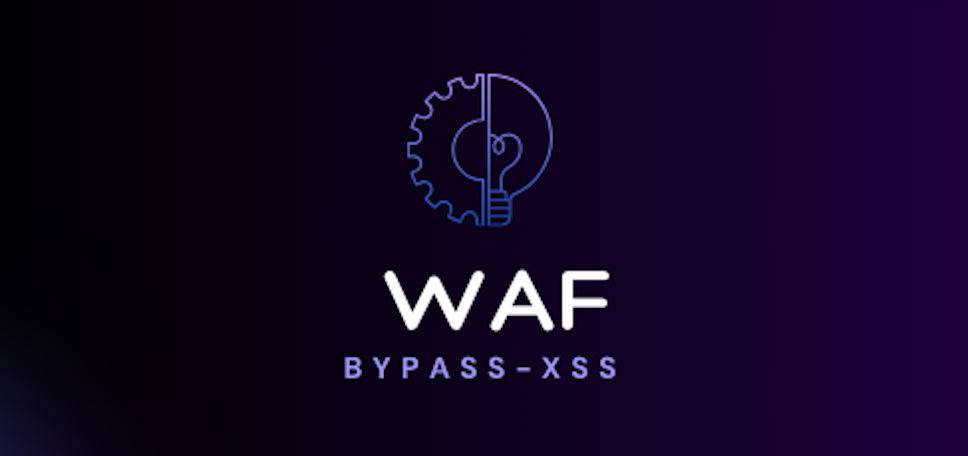

<h1 align="center">
  
  <br>
</h1>

<h4 align="center">Web Application Firewall Bypass For XSS Vulnerability Testing</h4>

<p align="center">
  <a href="#Features">Features</a> •
  <a href="#Install">Install</a> •
  <a href="#Post-Installation">Post Installation</a> •
  <a href="#Usage">Usage</a> 
  
</p>

---

`wafbypass-xss` consists of two Python scripts, gkg.py and kg.py, designed to generate and test Cross-Site Scripting (XSS) payloads for web security testing.

gkg.py generates a large set of mutated XSS payloads from a base input file, leveraging techniques like HTML/URL encoding, string reversal, and regex-based generation.

kg.py automates the testing of these payloads against a target URL using a headless Chrome browser to detect successful XSS executions.

Together, these scripts provide a robust toolkit for security researchers to identify XSS vulnerabilities in web applications.

---

# Features

- Payload Generation, Creates diverse XSS payloads through mutations like encoding, case changes, and noise insertion, with support for regex-based patterns.
- Automated Testing: Uses Selenium with a headless Chrome browser to test payloads concurrently, logging successful executions to a file.
- Scalability: Supports chunked output for large payload sets and multi-threaded testing to handle high volumes efficiently.

# Install

```sh
pip install -r requirements.txt
```

# Post-Installation

```sh
python3 gkg.py
```

# Usage

```sh
python3 kg.py
```
